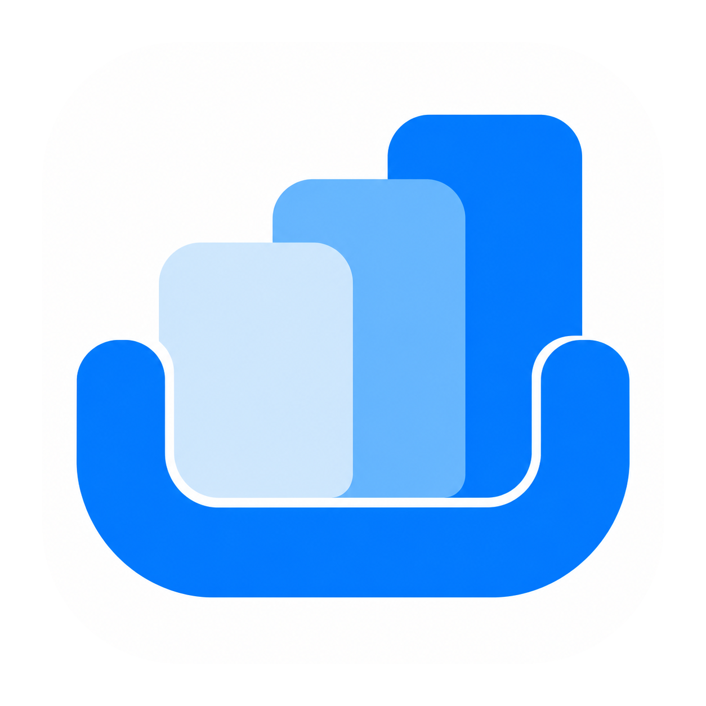
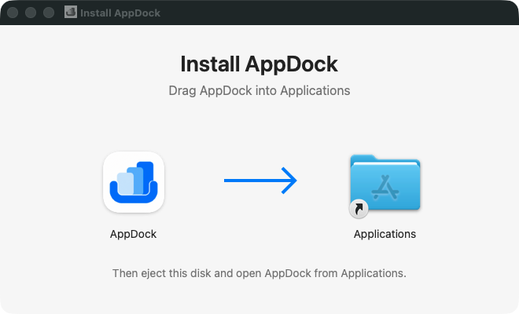

  

<h1 align="center">AppDock</h1>

Your Mac apps, together in one tabbed workspace.

Keep your open app windows organized and switch between them with a click.

**[Download for Mac](https://github.com/aiman2039/appdock/releases)** · macOS 12 or later

## Features

- **Apps as tabs** — bring open windows into one workspace.
- **Make it yours** — drag tabs to reorder them; double-click to rename.
- **Stay informed** — see notification counts or dots from your apps’ Dock badges.
- **Move together** — move or resize AppDock to keep your windows in place.
- **Choose your startup apps** — automatically add windows from apps you already have open.
- **Keep apps running** — remove a tab or close AppDock without quitting your apps.

## Take a look

**Four apps, one workspace.** Keep WhatsApp, Spotify, Telegram, and Discord together.

**Your tabs at a glance.** See app icons, the selected tab, and notification badges.

*Captured from a real workspace. Telegram names, profile pictures, and messages are blurred for privacy.*

## Get started

1. Download the **universal DMG installer**. The same download runs natively on Apple Silicon and Intel Macs.
2. Open the DMG and drag **AppDock** onto **Applications** in the installer window.
3. Eject the installer, then open **AppDock** from Applications.
4. Follow the setup wizard inside AppDock: verify Accessibility access, check available windows, and dock a window to test control.
5. Confirm you can interact with the docked window, then finish setup. Use **+ Add App** for more windows.

Reopen the wizard from **AppDock → Setup & Diagnostics**. If Accessibility is enabled but verification fails, quit older copies, remove the old AppDock entry from Accessibility settings, add the copy in Applications, enable it, and reopen AppDock. Screen Recording and Input Monitoring are not required for window control.

In **Settings**, choose which running apps to add next time. AppDock starts with an empty workspace until you choose startup apps.

The release workflow signs and notarizes both the app and the DMG installer, and attaches Apple’s verification tickets for offline opening. ZIP downloads remain available as an alternative.

Use **AppDock → Check for Updates…** for future releases. AppDock checks for updates every 60 seconds while running and shows a popup once per new version per session. You can turn automatic checks off from the AppDock menu; AppDock restores your managed windows before restarting to install an update. Older builds without Sparkle need one manual upgrade first.

## Good to know

- AppDock works on one desktop at a time. If docking pauses after fullscreen, a dialog, or a desktop change, return and click **Resume**.
- Notification badges depend on what each app shows in the Dock.
- AppDock organizes existing windows; it doesn’t launch apps or create separate accounts.

For building, testing, and technical details, see the [developer guide](docs/DEVELOPMENT.md).
