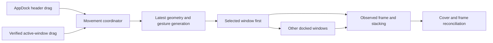

# AppDock interaction and window cohesion

Implementation follow-up: the high-confidence subset was subsequently accepted and implemented locally. See [the scoped validation record](HIGH-CONFIDENCE-POLISH.md). The assessment below remains the original research baseline; its broader proposals are not all implemented.

AppDock can feel substantially more cohesive while preserving direct interaction with native applications. The strongest next step is a focused redesign of movement scheduling, window state, and recovery. Its current architecture already has useful safeguards; the remaining problems are concentrated in the interactions that make independent windows feel independent.

The recommended product contract is: **a docked window stays associated with its workspace, movement feels connected, and an interruption affects the smallest possible scope.** A minimize action should never leave the entire workspace mysteriously paused. A failed app should not hold up another app's movement. Releasing a tab should remain dependable even when restoration fails.

Perfect Chrome-style containment has a platform boundary. The public APIs reviewed provide external window control and AppKit window composition, but no supported mechanism for turning an arbitrary, unmodified third-party window into AppDock-owned content. Treat exact clipping, removal of every foreign title bar, universal minimize prevention, and atomic cross-process movement as separate feasibility questions. They are not established capabilities of the present design.[^1][^2][^3]

## Scope and evidence

This assessment covers AppDock 0.12.0 at commit `237731c3ffbeded3a7463ec391acef07a3d3d834`, inspected on September 14, 2026. It evaluates the Rust/AppKit/Accessibility implementation, Apple documentation and SDK headers, and relevant open-source window managers. Recommendations assume direct native interaction and public APIs for the default product. Private APIs and capture are evaluated as alternatives, without assuming they are approved implementation dependencies.

The current command `cargo test --all-features --locked --offline` passed **92 tests, with no failures or ignored tests**, on macOS 26.6.2, build 25G83. The installed SDK inspected was 26.5. These are deterministic regression results, not a measurement of physical dragging, compositor latency, or compatibility with the user's actual apps. Historical native evidence is identified separately below. This document specifies proposed work; it does not establish that the changes have shipped.

### Immediate answers

| Question | Finding | Recommended product behavior |
| --- | --- | --- |
| Can docked apps look bounded while dragging? | Yes, substantially better coordination and framing are feasible. Exact native embedding is not available through the reviewed public interfaces. | Prioritize the selected window, keep coverage correct throughout movement, and measure the visible seam. |
| Can AppDock disable minimize on another app? | Not universally through public AX. The minimize state is writable; the button reference and enabled-state attribute are documented as read-only. | Handle minimization per tab. Offer a bounded “Keep selected window open” experiment only if desired. |
| Can minimized windows appear in Add App? | This is already implemented for eligible AX windows, including a transient minimized-dialog case. | Preserve that support and improve partial discovery, state labels, and restore feedback. |
| Can dragging the app's own title bar move the group? | A public-API follower design is plausible, but external movement intent and timing require validation. | Prototype active-window-led movement with one geometry authority at a time. |
| Can all native title bars disappear? | No general supported external style-mask setter was found. | Integrate AppDock's own frame cleanly while preserving target controls. |
| Can capture produce a perfectly clipped surface? | Captured pixels can be clipped inside AppDock. Native interaction does not come with them. | Consider capture for previews or a temporary drag surface, after proving the transition. |

The platform distinctions above are grounded in Apple's AppKit and AX interfaces, including the installed SDK's attribute contracts.[^1][^2][^3][^4]

## What the implementation already gets right

Several essential foundations should survive the redesign:

- AX objects, rather than window titles, identify live attachments. Duplicate-title windows must remain distinguishable.
- Window control runs off the AppKit thread. The mailbox wakes immediately and coalesces queued geometry.
- Position-only movement avoids resize settling. A separate nominal 120 Hz sampler runs in the native event-tracking mode.
- Switching does not minimize the old tab. A selected window remains directly interactive above an opaque backdrop.
- Minimized targets restore before capability validation, positioning, and focus. Their original minimized state is retained for explicit release.
- Release drops ownership before restoration IPC; failed restoration remains a separate retry record.
- Picker and rename interactions use a focus barrier. Geometry revisions protect later requests from stale completion.
- Configured startup registers all eligible matching windows while initially restoring only the first selection.

These are verified source properties, not assumptions from the older review documents. The relevant implementation is in [`engine.rs`](../src/engine.rs), [`worker.rs`](../src/worker.rs), [`macos.rs`](../src/macos.rs), and [`ui.rs`](../src/ui.rs). The research should refine these paths rather than rebuild the application framework.

## Why dragging can still look disconnected

### The selected window competes with inactive windows

`Engine::follow_workspace` iterates `live.values_mut()` and moves every attachment marked `docked`. The container is a `HashMap`, so the selected window has no guaranteed priority. Each write completes before the next starts. The fast path returns on the first error, so an inactive window can also prevent later members from receiving that movement request. See [`engine.rs`](../src/engine.rs), lines 321–337.

**Inference:** a slow inactive target can add latency before a visible target moves, and that exposure grows with the number of previously selected tabs. The source establishes the scheduling problem; its actual visual cost still needs measurement with real applications.

The first improvement should retain all-window following but move the selected member first in a stable order. Recheck the latest geometry revision between operations and stop obsolete work before issuing another AX write. Handle a failed inactive member locally instead of abandoning unrelated movement.

This does not interrupt an AX call already executing. Every ordinary AX request currently permits a one-second timeout. Merely putting geometry first in the mailbox cannot preempt an ongoing discovery, focus, restore, badge, or background-window operation. Use smaller measured budgets for interactive work, cancellation checkpoints between calls, and explicit separation of background work. If a slow target still blocks the selected one, prototype serial command lanes per application process; keep same-process writes ordered and preserve one owner for each retained AX object. More threads alone do not solve contention inside a target app.

### Sampling frequency is not presentation synchronization

`track_drag` samples the manager's WindowServer bounds and moves the backdrop on the main thread, then sends geometry to the worker. The target app processes its AX movement separately. These are separate paths to the compositor. A nominal 120 Hz timer cannot make them one atomic frame. See [`ui.rs`](../src/ui.rs), lines 769–782 and 1096–1143.

The existing tracking-mode sampler is important because run-loop modes affect which timers execute during a native drag. Keep it until an alternative is measured. A display-linked sampler can be evaluated on supported deployment targets, but it synchronizes AppDock's callback cadence, not another process's window update.[^5][^6]

### Deferring inactive windows creates a coverage problem

Moving only the active app would reduce IPC, but the current backdrop follows the manager. If inactive apps remain at the old location, they can become exposed and clickable. Their real shadows can also extend beyond their AX frames. A performance patch that ignores coverage would exchange lag for stray windows.

The recommended order is:

1. Prioritize the selected window while continuing to move the others.
2. Measure where latency remains, including the inactive-window contribution.
3. Only then evaluate deferred inactive movement with coverage at both old and new locations.

A dual-cover prototype should keep a stationary cover over old inactive bounds and a moving cover beneath the selected surface, then remove the old cover after reconciliation. Reject the design if it obscures unrelated desktop content, blocks useful clicks, leaks shadows, or leaves a large blank trail. A single union rectangle is simple but may cover much more desktop than the group occupies. This is a feasibility experiment, not a proven shortcut.

### Dragging the target currently ends in snap-back

The observer waits for pointer release and returns manually moved docked windows to `engine.area`. That preserves ownership, but it visibly contradicts the idea that the app and tab strip form a unit. See [`engine.rs`](../src/engine.rs), lines 434–447 and test `moved_window_returns_after_mouse_release_and_keeps_ownership`.

Prototype a **follow-the-active-window** interaction. When a verified user movement starts on the selected external window, let its frame lead and move AppDock's owned frame around it. While AppDock's own header leads, external frame notifications acknowledge or report drift; they must not move the manager back. Track gesture identity, source, expected frame, selection generation, and a final reconciliation phase.

An AX move notification alone does not prove a title-bar drag. Apps move themselves, other window managers issue writes, and users drag documents inside windows. Do not infer movement authority solely from “mouse is down.” Begin with an explicit workspace drag region, then add external-title-bar following only after reliable classification. Never synthesize content drags to implement group movement.

## A movement architecture worth building

The proposed control flow preserves native input and the existing worker boundary:

The coordinator should represent movement as a session: origin, leader, requested geometry, confirmed geometry, generation, and phase. Use `Idle`, `Dragging`, `Settling`, and `Interrupted` for movement; keep lifecycle conditions separately. Pointer-up must trigger a final flush even when no more move callbacks arrive. Selection, release, a modal transition, permission loss, and display changes invalidate relevant work immediately.

Each geometry operation must carry an immutable target identity and revision. Read the newest request between writes. Update expected geometry only for writes that actually succeeded, then verify the final selected frame and exact stacking anchor. Preserve the current prohibition on touching released windows and the current cancellation barriers around text input.

For resizing, prioritize the selected app's real constraints. The existing checked path waits for stable readback and accepts app-enforced sizes; keep it for settling and restoration. A fast live-resize path may publish provisional geometry, but final acceptance must reconcile actual dimensions. Do not grow the manager continually from stale snapshots or animate it after every small change in a target's minimum size.

## Minimize behavior: prevention, recovery, and intent

### What macOS permits

`AXMinimized` describes the current state and can be written when the target supports it. That enables restore and minimize requests. It does not set a policy prohibiting future minimization. Apple's SDK marks `AXEnabled` and `AXMinimizeButton` read-only; the latter returns the button element, not an editable AppKit control. Runtime settable checks remain necessary because application support varies.[^3][^4][^7]

AppDock can change its own `NSWindow` style and standard buttons. An AX reference to another app is not an `NSWindow` reference. `addChildWindow`, native tab groups, and `standardWindowButton` therefore do not provide a generic external-button or external-tab solution. This conclusion follows from the exposed API contracts; it should not be generalized to cooperating applications that deliberately implement an integration.[^1][^2]

Global shortcut interception would cover only some triggers. The yellow button, menu commands, alternate shortcuts, title-bar double-click preferences, automation, and application logic remain. Covering the button with another window also creates hit-testing and appearance problems. Neither approach should be marketed as “minimize disabled.”

### The current behavior has too wide an effect

`Engine::observe` turns a minimized-state change on any docked member into `engine.paused`. Switching then refuses to proceed, and the UI hides the cover when paused. An inactive app can consequently interrupt the entire group and expose other windows. The behavior is deliberately protected by `d2_minimizing_one_window_pauses_all_docking_until_full_resume`; changing it requires a new product contract and replacement regressions. See [`engine.rs`](../src/engine.rs), lines 167–182, 395–454, and [`ui.rs`](../src/ui.rs), lines 1440–1465.

### Recommended default

Treat minimizing as a per-tab state:

| Event | Proposed response |
| --- | --- |
| An inactive tab is minimized | Keep its membership, mark it minimized, exclude it from movement and visible coverage, and leave the active tab alone. |
| The selected tab is minimized | Keep the tab selected and show a deliberate AppDock-owned “Window minimized” surface with Restore. Other tabs remain usable. |
| A minimized tab is explicitly selected | Restore once, revalidate readiness and identity, position, focus, then confirm selection. |
| Restore fails | Show the reason on that tab, retain original-state recovery, and permit switching or release. |
| The target closes | Remove it only after verified closure; activate a suitable neighboring tab if that can succeed. |
| AppDock loses AX permission | Suspend the entire workspace and show a clear recovery action. This genuinely affects all members. |

The minimized placeholder must be an opaque owned surface. Leaving the normal transparent cutout in place would expose the desktop or another app. Its presentation cannot depend on a selected target remaining in the on-screen WindowServer list.

### Optional “Keep selected window open” policy

If stronger prevention is desired, an explicit setting can attempt one automatic restoration after unexpected selected-window minimization. Observe the state, wait for the transition, restore once, validate, and suppress recursive responses to AppDock's own write. Scope it to the selected docked window while the workspace is visible and interactive.

This is recovery after the event. The minimize animation may already be visible. Repeated minimization, a user pause/release, application hiding, a Space transition, or a failed restore must stop the loop and show a local state. Never let a window manager fight the user indefinitely. Keep this setting off by default until application-specific tests demonstrate that the recovery is preferable to the explicit Restore surface.

### Workspace minimize needs its own semantics

The existing visibility logic hides AppDock's backdrop when the manager is minimized; it does not establish a native group-minimize operation. Give “Minimize Workspace” an explicit transaction if implemented: record which managed members were visible, minimize only those whose capabilities allow it, and restore only the members changed by that transaction. A partial failure must be reported and recoverable.

This operation may produce several native animations. It should not be the mechanism for ordinary tab switching. Hiding an entire target application is also unsuitable for a per-window operation because it can affect unrelated windows from the same process. Distinguish application hiding from minimization through application lifecycle state and notifications.[^8]

## Adding minimized windows reliably

### The existing implementation is meaningful

`Ax::windows` merges `AXWindows` and window-role entries from `AXChildren`, then deduplicates by AX equality. Discovery reads `AXMinimized` and accepts `AXWindow`/`AXDialog` only when minimized. This handles a documented local reproduction in which native minimized windows temporarily had a dialog subrole and read-only `AXMain`.

The selected target is restored and given a cancellable readiness period before standard-window capabilities are required again. The nominal readiness deadline is 900 ms with 30 ms intervals, but an individual AX call can outlast that deadline. The picker already labels minimized entries. No discovery scan should restore windows just to inspect them. See [`macos.rs`](../src/macos.rs), lines 208–222, 382–439, and 548–598; [`model.rs`](../src/model.rs), lines 437–460; and [`picker.rs`](../src/picker.rs), lines 316–329.

### The next improvements

**Represent uncertainty.** `WindowInfo` currently reduces eligibility and minimization to booleans. An unavailable state read can lead to an ineligible or omitted entry without a useful explanation. Introduce state confidence and reasons: ready, minimized and restorable, waiting for controls, hidden application, unsupported capability, permission required, or unavailable. Missing data must not be presented as confirmed “not minimized.”

**Separate discovery from attachment eligibility.** Showing a candidate and permitting attachment are different decisions. Preserve useful candidates with disabled actions and actionable explanations, while continuing to exclude genuine helper windows and non-window objects. A currently visible window should not automatically fail basic docking eligibility solely because it cannot minimize; require restoration capability when restoration is actually needed. The current `WindowCapabilities::can_attach` unconditionally requires `minimize`, which is stricter than that proposed contract.

**Contain scan failures.** Some optional AX errors are swallowed into missing data; other errors can fail the scan, and the worker clears the whole picker list on discovery failure. Return per-application outcomes, preserve clearly marked previous results, publish successful applications incrementally, and revalidate the exact selection before mutation. Global permission loss should invalidate access immediately. A failed scan must never masquerade as a successful empty inventory.

**Refresh at meaningful events.** Add observer-triggered refresh for creation, minimization, restoration, focus, and closure, plus application launch/termination/hide/unhide. Preserve a bounded polling fallback. Apple explicitly permits notification registration to fail as unsupported, so observer support must be recorded per app or element. Maintain observers and their run-loop sources for the lifetime of subscriptions; callbacks should enqueue facts and avoid synchronous geometry work.[^9]

**Make the action say what happens.** Use “Restore & Add” for a minimized candidate and show “Restoring…” immediately after activation. Disable duplicate submission. Keep keyboard selection stable during incremental updates. Never replace an exact selected window with the first similarly named result after a refresh.

Hammerspoon's own documentation distinguishes minimized and invisible windows and describes Space-related discovery limitations. That is useful corroboration that a visible-window list is not an inventory of every eligible window; it is not proof that AppDock shares every Hammerspoon limitation.[^10]

## Other issues that determine whether AppDock feels finished

### Dialogs and sheets

A tab may have a document-modal sheet, an application-modal dialog, or a separate panel. These do not have the same scope. A sheet should keep its owning tab accessible, an application-modal dialog may block all windows of that process, and an unrelated app should continue working. When scope is uncertain, avoid geometry writes to the affected app and expose its dialog instead of placing a cover above it.

Switching away from a modal target currently triggers a workspace pause. Replacing global pause with local states must preserve the underlying safety: do not resize a modal window, swallow confirmation dialogs, or force focus through an unresolved modal loop. Test Save/Open sheets, browser permission prompts, application settings panels, and app-wide modal dialogs separately.

### Focus and interaction

Maintain a clear distinction between requested tab, confirmed active window, and temporary AppDock text editing. Show immediate pending feedback without claiming that focus has already moved. Cancel stale operations when a newer user intent arrives. The first click after switching must reach the correct native app; cursor changes, selection, scrolling, context menus, IME composition, file drops, and keyboard shortcuts must remain native.

Historical fixtures include intermittent focus-acquisition and pointer-occlusion failures. The unchanged native fixture later passing in isolation does not close those gaps. Make repeated focus acquisition part of acceptance, with failure logs retained. See [`STARTUP-AND-MINIMIZED-WINDOWS.md`](STARTUP-AND-MINIMIZED-WINDOWS.md) and [`SETTINGS-AND-FRAME.md`](SETTINGS-AND-FRAME.md).

### Spaces, displays, fullscreen, and other window managers

Keep fullscreen, hidden, minimized, off-Space, and closed as distinct concepts. Absence from an on-screen WindowServer list does not identify which condition occurred. Preserve ownership through temporary visibility changes; reconcile identity, frame, and stacking after the desktop becomes usable.

Measure display transitions with negative coordinates, mixed Retina scale factors, different refresh rates, Dock positions, and “Displays have separate Spaces” both enabled and disabled. Constrain recovery frames to an available visible display after unplugging a monitor. Avoid a default that requires users to change system-wide Spaces settings.

Two managers controlling the same window can create oscillation. Detect repeated conflicting moves within a short interval, stop correcting that target, and offer Release or Resume. An optional per-application exclusion is more useful than a constant tug-of-war. AeroSpace's documented corner parking and monitor constraints show why moving inactive windows off-screen is not a universal hiding solution.[^11]

### Closing, release, and recovery

The tab × currently means release, not closing the external document. Preserve that distinction and label its tooltip “Release window.” Do not bind the target app's normal close shortcut to a different action while it has focus. When the selected tab is released or closes, choose a neighboring valid tab and confirm its activation rather than leaving surviving tabs behind an unexplained empty area.

Keep the existing default that AppDock close restores geometry while leaving successfully docked apps open. Offer an explicit “Release and keep open” action for a window whose original minimized state would otherwise be surprising; retain “Restore original state” as a clear alternative.

The engine's original restoration snapshots are currently memory-only, while launch clears saved tabs. A later reliability milestone should introduce a separate, minimal recovery journal written before the first mutation. It must not silently reconnect old tabs. After a crash, propose recovery only for unambiguous targets, validate identity beyond recycled PIDs/window numbers, and avoid guessing from titles. Ambiguous cases need a user-selected target. Recovery must survive journal write failures, partial restores, and target termination.

### Visual refinement and accessibility

Use one stable AppDock control strip with tabs visibly connected to the frame. The current fixed 160-point tabs, 8-point frame, and hardcoded dark palette provide a baseline, but they do not yet define a complete adaptive design. Prototype a narrower frame only after shadow and pointer tests pass. Do not assume painting a rounded hole clips an external window or removes its shadow.

Keep document titles out of the primary tab label unless needed to distinguish multiple windows from one app. Add a short secondary label or tooltip for that case. Reordering should preview the insertion position while dragging, retain the selected tab, scroll near the strip edges, and support Escape and keyboard alternatives. The current pan handler commits an order only at gesture end.

Reserve header geometry for status rather than expanding the docking area for routine messages. Present per-tab restoration or availability states locally. Preserve a visible close/release affordance for the active tab and keyboard focus, even if idle tabs use quieter hover treatment.

Audit actual VoiceOver roles, names, selected state, tab order, and release actions. Add keyboard reorder and focus-visible behavior. Validate Reduce Motion, increased contrast, text truncation, and light/dark appearance; hardcoded colors and `DarkAqua` need an intentional product decision. These are recommendations, not claims that a current accessibility audit has passed.

The inspected historical design image contains disconnected dummy tabs, so it is useful only as an earlier visual baseline. It cannot establish current native app framing or drag quality: [`design.png`](review-evidence/settings-corners/design.png).

## Alternatives and their limits

| Approach | What it can improve | What it does not establish | Disposition |
| --- | --- | --- | --- |
| Public AX with AppKit frame/backdrop | Native input, recovery, movement scheduling, visual association | Atomic movement or arbitrary clipping | Recommended default |
| Public AppKit child windows/native tabs | Composition of windows the app can reference and manage | Importing unrelated apps by AX or WindowServer ID | Use only for AppDock-owned surfaces or cooperating integrations |
| ScreenCaptureKit previews | Clipped thumbnails and a possible drag-time visual surface | Full input, dialogs, window ownership, or live minimized content | Optional prototype |
| Private WindowServer APIs | Potentially faster geometry, ordering, and presentation control | Stable cross-version behavior or authority over arbitrary foreign windows | Isolated research branch only if selected |
| App cooperation/plugin | Real content integration and explicit control of window policy | Universal support for existing unmodified apps | Strongest path for a limited supported-app mode |

### Capture is useful when its scope is narrow

Apple's ScreenCaptureKit session demonstrates capture of an occluded single window. It also states that minimized-window output pauses and that a single-window filter excludes child and popup windows. Pixels alone therefore cannot replace the app's full interactive surface.[^12]

A drag-only preview is more plausible than a permanent remote desktop. Capture the selected window before dragging, render it inside AppDock while movement settles, then reveal the real target only after geometry, stacking, and pointer routing are ready. This still requires capture permission and a way to cover the real target at its old position without revealing or blocking unrelated content. Define behavior for missing/stale frames, protected content, display-scale changes, permission revocation, and a dialog arriving mid-drag. No synthetic input should be needed if the preview exists only during the workspace gesture.

Do not make capture mandatory for ordinary docking. Test whether the preview actually reduces visible defects and whether the restore-to-live transition is better than optimized direct movement.

### Private APIs are a real research avenue, not a guaranteed answer

JankyBorders uses WindowServer interfaces for border geometry and declares transaction functions such as `SLSTransactionMoveWindowWithGroup`. That is evidence of a different implementation technique, not evidence that AppDock can atomically group and control arbitrary foreign windows using the same call. A symbol's name does not establish its ownership rules.[^13]

Yabai's current documentation identifies features such as window-layer control, transparency, and shadow removal as requiring its Dock scripting addition and partially disabled System Integrity Protection. Do not infer that every private API requires this setup; evaluate the exact operation and connection privileges. Equally, do not claim that a helper making its own border move proves it can move the target with the same authority.[^14]

Any experiment needs a narrow success criterion, runtime availability checks, cleanup after partial failure, and a public-API fallback. It should not require reduced system protection for the default AppDock experience. The distinction matters because a polished daily-use product needs predictable upgrades as well as attractive demonstrations.

## A measurable quality bar

Define results per app version, macOS version, display configuration, and binary hash. An “AX write completed” timestamp is not a “frame appeared on screen” timestamp. Instrument input/geometry publication, worker dequeue, AX completion, observed WindowServer bounds, and cover reconciliation separately.

The following are **proposed engineering targets**, not measured performance claims or universal promises:

| Measure | Initial acceptance target |
| --- | --- |
| AppDock response to a click or drag | Pending feedback within 50 ms at the 95th percentile |
| Already-ready tab activation | Correct frame and focus within 150 ms at the 95th percentile; report restored/minimized targets separately |
| Steady drag alignment | Resting seam within 2 points; target moving seam within 4 points at the 95th percentile for a defined moderate-speed trace |
| Visible follower delay | Aim for one display interval; report both time and point error because speed changes spatial lag |
| End of drag | Final reconciliation within 100 ms at the 95th percentile for responsive targets |
| State events | Observer-supported changes displayed within 100 ms at the 95th percentile; unsupported providers tested against a stated polling bound |
| Inactive-member interference | A stalled inactive app must not prevent selected-app movement once request isolation is implemented |
| Recovery | No released window moved again; no unrelated window changed; retry record retained for every unfinished restore |

Record median, 95th, and 99th percentile, maximum, failures, and sample count. Test 1, 3, 8, and 20 docked windows, with both same-process and different-process tabs. Use 60 Hz and 120 Hz displays where available. Include a deliberate unresponsive app and continuous reversals in the drag path.

WindowServer bounds sampling is necessary but insufficient for visual quality. Pair deterministic traces with frame-by-frame screen recordings or an external high-speed camera where timing fidelity matters. Record capture overhead and sampling limits. Playback should reveal gaps, double images, stray inactive windows, shadow trails, and wrong click destinations. User-driven acceptance should include fast drags and diagonal monitor crossings, even when those exceed the initial quantitative target.

The compatibility matrix should cover Safari and Chrome, Finder and TextEdit, Terminal, Electron apps such as Discord/Spotify/VS Code, a JetBrains IDE, and a SwiftUI application. These are proposed targets, not currently certified apps. Include multiple identical titles, delayed readiness, sheets, native fullscreen, app hiding, minimize-to-app-icon settings, wake/unlock, monitor unplug, permission loss, and coexistence with another manager.

Historical movement evidence measured AX request processing and historical tracking evidence counted samples in a nested run loop. The repository itself explicitly says those did not measure physical mouse-to-compositor behavior in Discord. Preserve that boundary when reporting improvements: [`VALIDATION.md`](VALIDATION.md), lines 74–99.

## Delivery order

The implementation backlog is in [`APPDOCK-POLISH-BACKLOG.md`](APPDOCK-POLISH-BACKLOG.md). Its dependency order is:

1. Establish a repeatable visual baseline and movement telemetry.
2. Prioritize selected-window movement and eliminate unnecessary switch settling.
3. Introduce scoped lifecycle state and resilient minimized-window discovery.
4. Implement per-tab minimize recovery, then validate coverage and modal behavior.
5. Prototype active-window-led group movement and improve tab gestures.
6. Complete display transitions, recovery journaling, accessibility, and sustained compatibility testing.
7. Evaluate capture or private APIs only against defects that remain measurable after the public-API work.

The most valuable first implementation is selected-window-first scheduling plus measured switch and drag behavior. The largest product improvement after that is removing workspace-wide pause for ordinary per-window minimization. Those changes address the interaction model directly and make the remaining visual refinements meaningful.

## Sources

All online sources below were consulted on September 14, 2026. Apple reference pages and live project branches are undated unless a date is stated. Version-specific runtime behavior still requires validation on supported systems.

[^1]: Apple. [NSWindow](https://developer.apple.com/documentation/appkit/nswindow). Public AppKit window ownership, composition, geometry, and standard-control interfaces. The installed AppKit `NSWindow.h` also confirms that child/tab methods accept `NSWindow` objects, and marks `initWithWindowRef` deprecated; it is not a modern foreign-window import solution.

[^2]: Apple. [tabbingIdentifier](https://developer.apple.com/documentation/appkit/nswindow/tabbingidentifier-swift.property) and [standardWindowButton](https://developer.apple.com/documentation/appkit/nswindow/standardwindowbutton(_:)). Native grouping and access to controls in an NSWindow's own view hierarchy.

[^3]: Apple. [kAXMinimizedAttribute](https://developer.apple.com/documentation/applicationservices/kaxminimizedattribute). Meaning of minimized state. Also checked against the installed SDK contract in source 4.

[^4]: Apple. macOS SDK 26.5, `ApplicationServices.framework/Frameworks/HIServices.framework/Headers/AXAttributeConstants.h`, lines 449–460, 822–832, and 866–877. Locally inspected primary source: `AXEnabled` and `AXMinimizeButton` are read-only; `AXMinimized` is writable. Header root: `/Library/Developer/CommandLineTools/SDKs/MacOSX.sdk/System/Library/Frameworks/`. These are API contracts, not evidence of compliance by every application.

[^5]: Apple. [Run Loop Management](https://developer.apple.com/library/archive/documentation/Cocoa/Conceptual/Multithreading/RunLoopManagement/RunLoopManagement.html). Archived conceptual documentation, also referenced by AppDock's existing architecture and validation documents; scheduling mechanisms should be checked against the deployment SDK.

[^6]: Apple. [NSWindow displayLink(target:selector:)](https://developer.apple.com/documentation/appkit/nswindow/displaylink(target:selector:)). Display-synchronized callbacks for owned-window presentation; also listed in the NSWindow reference and installed `NSWindow.h`.

[^7]: Apple. [AXUIElementIsAttributeSettable](https://developer.apple.com/documentation/applicationservices/1459972-axuielementisattributesettable). Runtime capability checking, unsupported attributes, and messaging failure.

[^8]: Apple. [NSWorkspace.didHideApplicationNotification](https://developer.apple.com/documentation/appkit/nsworkspace/didhideapplicationnotification). Application hiding as a separate lifecycle event.

[^9]: Apple. [AXObserverAddNotification](https://developer.apple.com/documentation/applicationservices/1462089-axobserveraddnotification). Notification registration and unsupported-notification results. Also inspected SDK `AXUIElement.h`, lines 609–625, and `AXNotificationConstants.h`, lines 116–150, for movement, resize, miniaturization, and deminiaturization events.

[^10]: Hammerspoon project. [hs.window documentation](https://www.hammerspoon.org/docs/hs.window.html), particularly `allWindows`, `minimizedWindows`, and `invisibleWindows`. First-party documentation of its own window enumeration and limitations.

[^11]: AeroSpace project. [AeroSpace Guide](https://nikitabobko.github.io/AeroSpace/guide), sections 4–4.3. Corner parking and monitor/Spaces tradeoffs. These describe AeroSpace's implementation, not a formal Apple guarantee.

[^12]: Apple, Meng Yang and Drew Mills. [Take ScreenCaptureKit to the next level](https://developer.apple.com/videos/play/wwdc2022/10155/), WWDC22. Single-window capture behavior, minimized output, popup/child exclusions, and pixel-scale metadata. Historical framework explanation; current deployment behavior remains a prototype test requirement.

[^13]: FelixKratz/JankyBorders. [Repository](https://github.com/FelixKratz/JankyBorders), [border implementation](https://raw.githubusercontent.com/FelixKratz/JankyBorders/main/src/border.c), and [WindowServer declarations](https://raw.githubusercontent.com/FelixKratz/JankyBorders/main/src/misc/extern.h), live `main` inspected on the consultation date. Evidence of interfaces used or declared by that project, not validated AppDock capability.

[^14]: asmvik/yabai. [Disabling System Integrity Protection](https://github.com/asmvik/yabai/wiki/Disabling-System-Integrity-Protection), page last edited April 18, 2026. Cited only for the project's listed scripting-addition requirements; no system-protection changes are part of this recommendation.

### Repository evidence map

| Source | Relevant inspected locations |
| --- | --- |
| [`engine.rs`](../src/engine.rs) | Attachment snapshots 4–23; switch 167–250; resize 252–270; release 272–307; movement 321–337; close 339–385; observer 395–454; resume 457–516 |
| [`macos.rs`](../src/macos.rs) | AX timeout 53–60; capabilities 86–121; merged window lists 208–222; state 299–332; discovery 382–449; resize/move 498–547; restore/readiness 548–598; focus 600 onward; polling 648–665 |
| [`worker.rs`](../src/worker.rs) | Coalescing mailbox 64–190; discovery 454 onward; lifecycle interval and snapshot construction 684–800 |
| [`ui.rs`](../src/ui.rs) | Frame/tab dimensions 29–30; hardcoded appearance 540; tracking timer 769–782; drag 1096–1143; cover visibility 1440–1465; settle raise 1484–1494; exact-window activation 1590 onward; picker eligibility 1815 onward |
| [`native_ops.rs`](../src/native_ops.rs) | Per-request cancellation 4–21; optional error handling 24–31; focus sequencing 72–103; resize settling 105–131 |
| [`model.rs`](../src/model.rs) | Candidate and state fields 123–138; minimized role and capability predicate 437–460 |
| [`picker.rs`](../src/picker.rs) | Action state 270–285; stable selection and minimized labels 286–355 |
| [`persistence.rs`](../src/persistence.rs) | Fresh launch and atomic workspace save 50–76; no persisted original attachment snapshots |
| [`VALIDATION.md`](VALIDATION.md) | Historical evidence, with explicit exclusions for compositor timing and real-app dragging |
